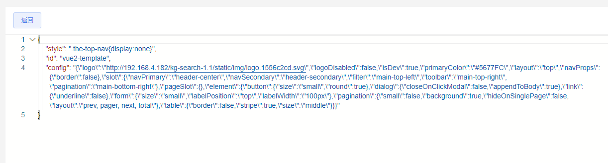

# 启用`KG-SEARCH`管理动态配置说明

### 应用场景
- 需要动态修改主题色
- 需要覆盖默认css样式
- 需要动态切换图谱、搜索项目空间、搜索索引、搜索api
- 其他需要动态修改的内容

### 先决条件
#### 保证`KG-SEARCH`能正常访问到，满足以下一条即可
- 1、`kg-search`产品与本项目/产品部署在同一个域名端口下
- 2、通过代理可以转发到`kg-search`的接口上

### 配置
#### 本项目配置
- 在`public/config.js`配置的顶层（`APPName`同一层）中找到并填写正确的`configNsId`，如果没有增加即可
- `configNsId`是配置在`kg-search`中的项目空间`id`
- `src/App.vue`中可以加载并使用动态配置修改主题色的案例
- `configNsId`同一层的`configBaseURL`可以配置`kg-search`的基础路径，默认空字符串表示`kg-search`与本项目在相同的域名、路径，通常生产环境使用空字符串，开发环境需要配置代理或者指定对应的服务器地址， 注意不要以`/`结尾

#### `kg-search`中配置说明
- 1、创建或使用某个项目空间，空间名称不限
- 2、创建或使用现有的索引，索引别名必须是`config`、其他不限
- 3、使用config.xls导入索引模式
    - 
- 4、数据说明：
    - `id`必须和本产品/项目的`APPName`相同
    - `config`是和`public/config`中相同结构的配置字符串
    - `style`支持css字符串
    - 
- 5、功能管理/基础配置中初始化功能并上线全文检索功能（无需进一步配置）
